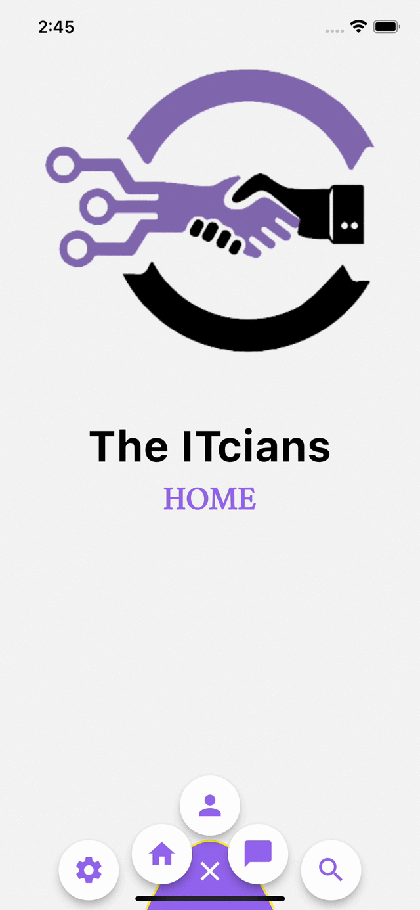

<h3>
Mountain Menu designed by <a href='https://itcians.com'>The ITcians</a>
</h3>


<p>A curved menu shaped like mountain crafted for your beautiful app.
You can set your default animation and theme for this menu.

Here is an example to start with:
</p>

```dart
class _MenuDemoState extends State<MenuDemo> {
  List<String> menus = ["HOME", "PROFILE", "NOTIFICATIONS"];
  int selectedIndex = 0;
  @override
  Widget build(BuildContext context) {
    return Scaffold(
      body: Center(
        child: Column(
          children: [
            Image.network(
                "https://avatars.githubusercontent.com/u/93488670?s=400&u=af911b0e99e78a599f08f47f1e3152700b869f6b&v=4"),
            const Text(
              "The ITcians",
              style: TextStyle(
                  color: Colors.black,
                  fontFamily: "Cursive",
                  fontWeight: FontWeight.bold,
                  fontSize: 40),
            ),
            Text(
              menus[selectedIndex],
              style: const TextStyle(
                  color: Color(0xff9264EB),
                  fontWeight: FontWeight.bold,
                  fontSize: 30),
            ),
          ],
        ),
      ),
      bottomNavigationBar: MountainMenu(
        color: Color(0xff9264EB),
        menuIcon: Icons.menu,
        mainButtonElevation: 0,
        mini:true,
        curve: Curves.easeIn,
        buttonBackgroundColor: Colors.white,
        onChange: (val) async {
          setState(() {
            selectedIndex = val;
            print(val);
          });
        },
        menus: const [
          Icon(
            Icons.home,
            color: Color(0xff9264EB),
            size: 24,
          ),
          Icon(
            Icons.person,
            color: Color(0xff9264EB),
            size: 24,
          ),
          Icon(
            Icons.chat_bubble,
            color: Color(0xff9264EB),
            size: 24,
          ),
        ],
      ),
    );
  }
}
```
<b>Properties:</b>
<ul>
<li>color: To change mountain's color</li>
<li>menuIcon: To change mountain's main icon</li>
<li>menus: List of three menu widgets</li>
<li>mini: Change the size of menu to mini and expanded</li>
<li>mainButtonElevation: To add elevation to main button</li>
<li>buttonBackgroundColor: To change background color of menu buttons</li>
<li>iconColor: To change color of menu icons</li>
<li>onChange: A menu change listener</li>
<li>curve: Animation Curve</li>
<li>borderWith: Border with of main menu button</li>
<li>duration: Animation duration</li>
<li>borderColor: To change border color of main menu</li>
</ul>
